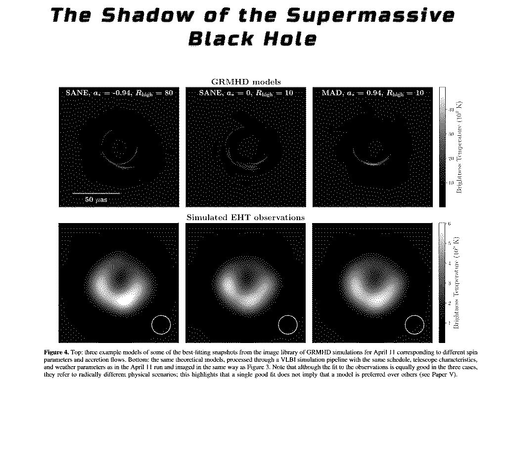
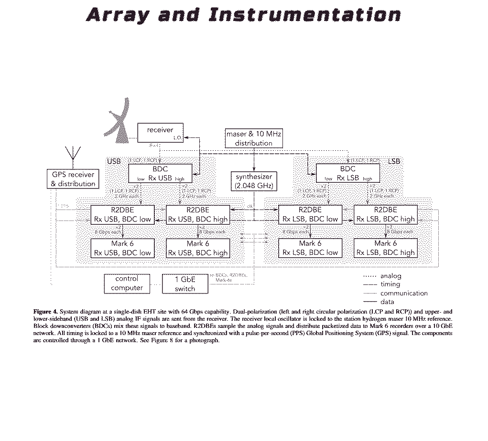
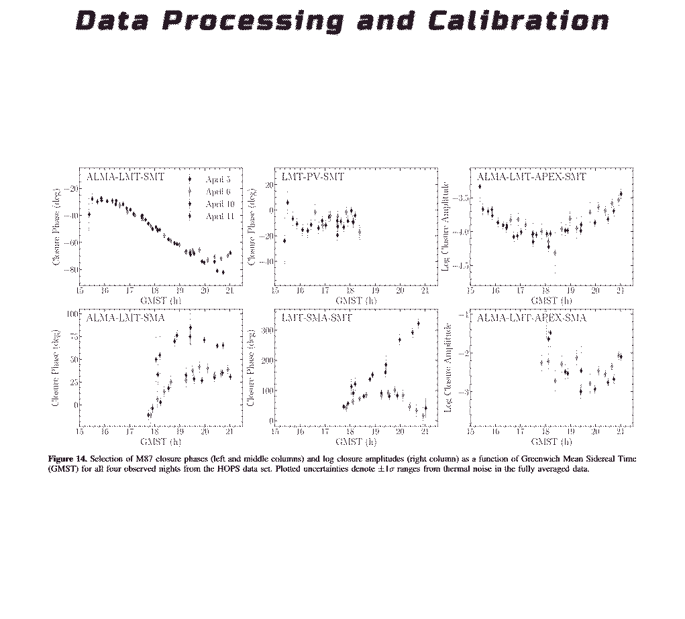
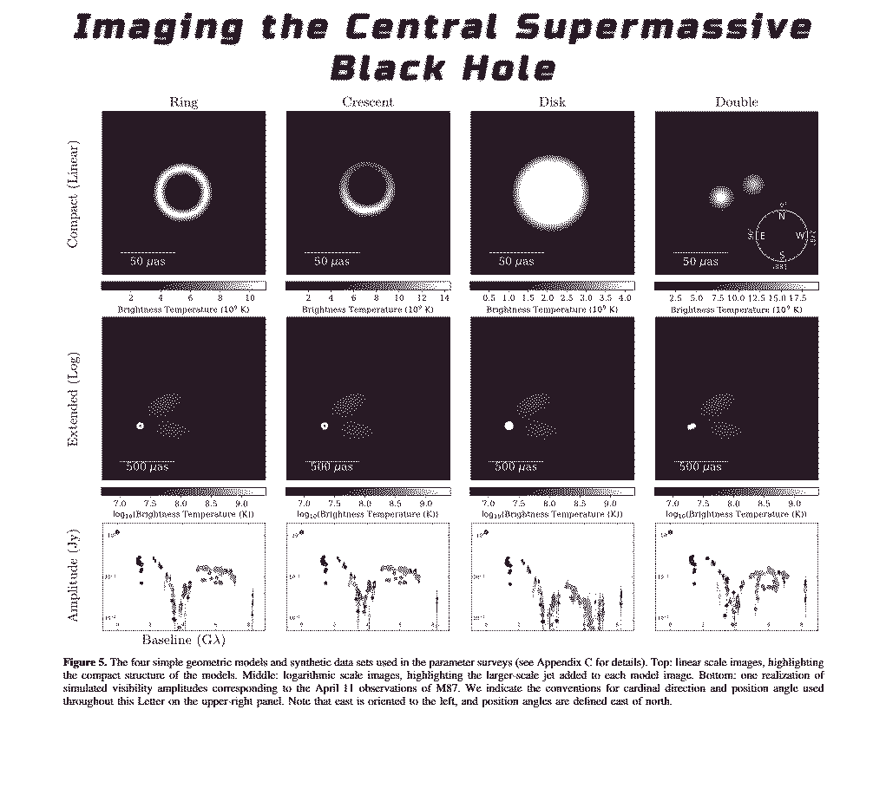
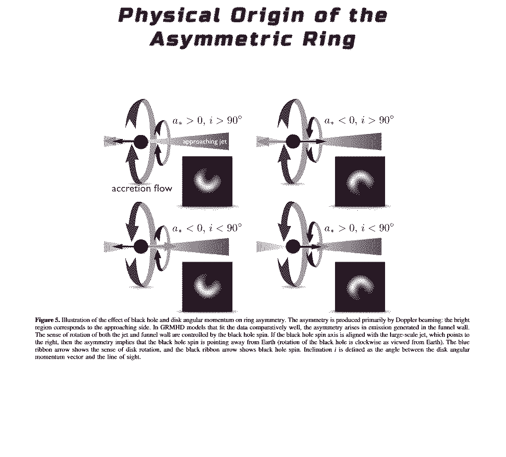
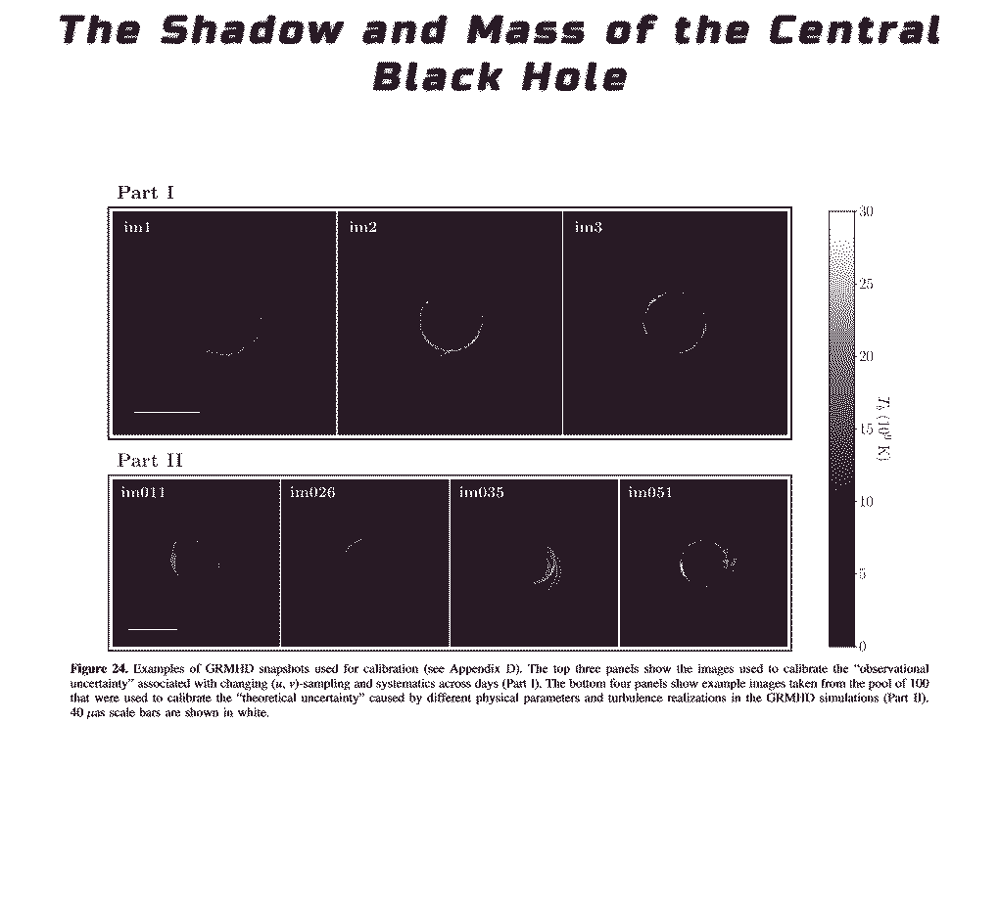

Exposición de obras realizadas por estudiantes de Artes Multimediales 1 (cátedra Lacabanne), cohorte 2021, 2do Cuatrimestre.

<!-- wp:paragraph -->

 <strong>Unicornios de Cauchy: el arte de la deriva entre datos y algoritmos</strong> 

<!-- /wp:paragraph -->

<!-- wp:paragraph -->

<strong>I. Aves</strong> 

<!-- /wp:paragraph -->

<!-- wp:image {"id":1513} -->
<figure class="wp-block-image"></figure>
<!-- /wp:image -->

<!-- wp:paragraph -->

<em>Las sombras se alargan en este ocaso, y transitamos el segundo milenio esperando que las sombras crezcan aún más.</em>

<!-- /wp:paragraph -->

<!-- wp:paragraph -->

—Somos una raza inconstante —dije.

<!-- /wp:paragraph -->

<!-- wp:paragraph -->

—Así es —dijo el Profesor Yarborough—. En el pasado, se nos dijo que una vez que una cosa llegaba a ser, sí permanecía. Nuestra herencia, nuestro patrimonio, nuestros ancestros, todo ello permanecía y sería lo que siempre había sido. Ahora, sin embargo, sabemos que nada permanece. Todo es cambio.

<!-- /wp:paragraph -->

<!-- wp:paragraph -->

—La naturaleza es una mujer cambiante —dije.

<!-- /wp:paragraph -->

<!-- wp:paragraph -->

<strong>II. Nubes</strong> 

<!-- /wp:paragraph -->

<!-- wp:image {"id":1515} -->
<figure class="wp-block-image"></figure>
<!-- /wp:image -->

<!-- wp:paragraph -->

<em>Hay algo inexorable de la angustia del futuro, aún cuando sólo sea estar a la altura de las expectativas depositadas en nosotros.</em>

<!-- /wp:paragraph -->

<!-- wp:paragraph -->

Cuando la angustia de la muerte se hace presente en nuestra vida, es más bien porque estamos a la altura de las expectativas depositadas en nosotros.

<!-- /wp:paragraph -->

<!-- wp:paragraph -->

La angustia de muerte es una invitación a escapar de la vida, a vivir a medias, a estar a la altura de las expectativas depositadas en nosotros.

<!-- /wp:paragraph -->

<!-- wp:paragraph -->

La angustia de muerte es una invitación a vivir a medias, a estar a la altura de las expectativas que hay que depositar en nosotros.

<!-- /wp:paragraph -->

<!-- wp:paragraph -->

La angustia de muerte se produce cuando estamos a la altura de las expectativas depositadas en nosotros.

<!-- /wp:paragraph -->

<strong>III. Ranae</strong>

<!-- wp:image {"id":1516} -->
<figure class="wp-block-image"></figure>
<!-- /wp:image -->

<!-- wp:paragraph -->

<em>La originalidad es el gran escándalo a que el resentimiento no puede acomodarse.</em>

<!-- /wp:paragraph -->

<!-- wp:paragraph -->

En una actitud sincera, constante, no hay nada de original, son las actitudes inconstantes, las actitud de los que quieren llamar la atención, las que siempre son originales.

<!-- /wp:paragraph -->

<!-- wp:paragraph -->

C.M. Cioran.

<!-- /wp:paragraph -->

<!-- wp:paragraph -->

No conozco a ninguna persona de quien pueda decir: esto es lo que realmente quiere.

<!-- /wp:paragraph -->

<!-- wp:paragraph -->

C.M. Cioran.

<!-- /wp:paragraph -->

<strong>IV. Equites</strong>

<!-- wp:image {"id":1517} -->
<figure class="wp-block-image"></figure>
<!-- /wp:image -->

<!-- wp:paragraph -->

<em>Toda ponderosa originalidad literaria se convierte en canónica.</em>

<!-- /wp:paragraph -->

<!-- wp:paragraph -->

Para una crítica del arte contemporáneo hace falta una nueva escuela de pensamiento.

<!-- /wp:paragraph -->

<!-- wp:paragraph -->

El artista es un fracasado; sólo puede triunfar el autor.

<!-- /wp:paragraph -->

<!-- wp:paragraph -->

Las grandes obras tienen una moral.

<!-- /wp:paragraph -->

<strong>V. Vespae</strong>

<!-- wp:image {"id":1518} -->
<figure class="wp-block-image"></figure>
<!-- /wp:image -->

<!-- wp:paragraph -->

<em>Uno solo irrumpe en el canon por fuerza estética, que se compone primordialmente de la siguiente amalgama: dominio del lenguaje metafórico, originalidad, poder cognitivo, sabiduría y exuberancia en la dicción.</em>

<!-- /wp:paragraph -->

<!-- wp:paragraph -->

De la literatura, la música y la pintura, la que está más influida por la estética es la pintura, que se ha vuelto, en buena medida, una mera representación de la realidad. Pero no así la música, que no se ha convertido en una simple representación de la realidad, sino en una auténtica expresión de la imaginación. La música del siglo XXI es mucho más exuberante y imaginativa que la del XX.

<!-- /wp:paragraph -->

<!-- wp:paragraph -->

La nueva música es una fusión de las tres disciplinas anteriores, con una marcada influencia del arte contemporáneo. Esta nueva música es una expresión de la imaginación más que una mera representación de la realidad. Esta nueva música es capaz de provocar en el oyente sensaciones diferentes a la pura representación. 

<!-- /wp:paragraph -->

<strong>VI. Ecclesiazusae</strong>

<!-- wp:image {"id":1519} -->
<figure class="wp-block-image"></figure>
<!-- /wp:image -->

<!-- wp:paragraph -->

<em>La recepción de la fuerza estética nos permite aprender a hablar de nosotros mismos y a soportarnos.</em>

<!-- /wp:paragraph -->

<!-- wp:paragraph -->

Toda apertura a esta fuerza estética está opuesta a la tendencia a rechazar y a combatir todo lo que nos resulta desagradable y a no aceptar nada que no encaje con nuestros conceptos.

<!-- /wp:paragraph -->

<!-- wp:paragraph -->

La apertura a esta fuerza estética nos permite aprender a aceptar todo aquello que nos resulta desconocido y a no aferrarnos a nuestra visión particular.

<!-- /wp:paragraph -->

<!-- wp:paragraph {"align":"right"} -->

Fuentes:  The Event Horizon Telescope Collaboration <em>et al</em> 2019 <em>ApJL</em>875 L1, Harold Bloom (ISBN:978-84-339-6684-1) y GPT-3  Procesamiento: Raúl Federico Lacabanne <em>Buenos Aires, 17 de noviembre de 2021</em>

<!-- /wp:paragraph -->

<!-- wp:paragraph -->

 <em>Buenos Aires, 17 de noviembre de 2021</em>

<!-- /wp:paragraph -->

<!-- wp:separator -->

<!-- /wp:separator -->

<!-- wp:paragraph {"align":"center"} -->

<em>Artistas: Antuña, Martin - </em><strong><em>Baez, Andres Roberto</em></strong><em> - Benítez San Pedro, Luisana De Los Ángeles - </em><strong><em>Cardozo, Marcela Emilce</em></strong><em> - Cimatti Capuano, Morena - </em><strong><em>Diaz, Sofia Cecilia</em></strong><em> - Frías Hernández, Joshua - </em><strong><em>Giron, Karina Gissel</em></strong><em> - Guerrero, Macarena Elizabeth Araceli - </em><strong><em>Gutiérrez, Agustín Nicolás</em></strong><em> - Iaria, Javier Oscar - </em><strong><em>Iarussi, Thomas Agustín</em></strong><em> - Juan, Vanesa Inés - </em><strong><em>Juárez, Aaron Joel</em></strong><em> - Lara Garces, Julieta Ximena - </em><strong><em>Lema Jacinto, Michael Anthony </em></strong><em>- Leno, Francisco Norman - </em><strong><em>León, Florencia Paula</em></strong><em> - Levy, Sophie Charlotte - </em><strong><em>López Santos, Jennifer Melissa Anita</em></strong><em> - Martelletti, Lucas - Pérez García, Amparo - </em><strong><em>Petrosino, Lara</em></strong><em> - Reina Espinoza, Oswaldo Alexander -</em><strong><em> Ruta, Ana Belén</em></strong><em> - Sogolo, Agustina - </em><strong><em>Stigliano, Luciano</em></strong><em> - Tello Martin, Pilar María - </em><strong><em>Troncoso, Romina Ayelén</em></strong> <em>a Del Valle - <strong>Tello Martin, Pilar María</strong> - Toledo, Florencia Michelle - <strong>Torrejon Torres, Carla Consuelo</strong> - Torrejon Torres, Nadia Melyna - <strong>Troncoso, Romina Ayelén</strong> </em>

<!-- /wp:paragraph -->

<!-- wp:paragraph {"align":"center"} -->

<strong><em>Cátedra</em></strong><em>: Raúl Federico </em><strong><em>Lacabanne</em></strong><em> (Titular), Mauricio </em><strong><em>Gutiérrez</em></strong><em> (Adjunto), Mirna Laura </em><strong><em>Barreiro</em></strong><em> (Jefa de Trabajos Prácticos), Agustín </em><strong><em>Genoud</em></strong><em> (Jefe de Trabajos Prácticos), Naira </em><strong><em>Barrios</em></strong><em> (Ayudante de Segunda), Gaspar </em><strong><em>Calvi</em></strong><em> (Ayudante de Segunda), Marcelo </em><strong><em>Dubovich</em></strong><em> (Ayudante de Segunda), Sebastián Axel </em><strong><em>Zavatarelli</em></strong><em> (Adscripto) y Diego </em><strong><em>Túmites</em></strong><em> (Adscripto).</em>

<!-- /wp:paragraph -->

<!--EndFragment-->

